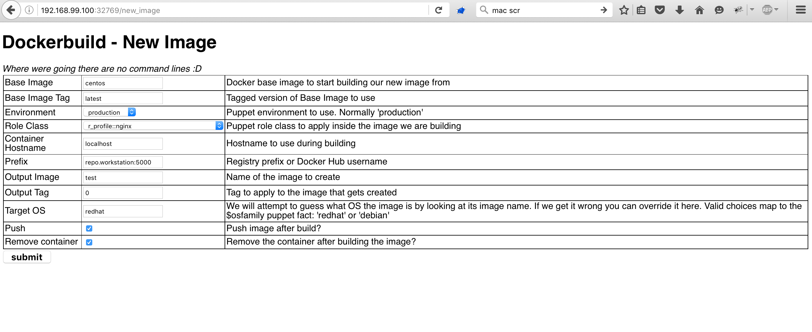
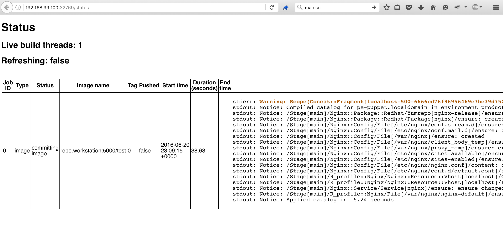
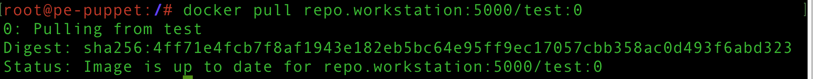

# puppet-dockerbuild

## What's this?
**Experimental** build docker images built with puppet mounted into a container.

This is an experiment I wrote for fun in my own time, not official work being done by Puppet (although I do work for them...)

## Why did you write it?
Just for fun and because I'm too lazy to remember the syntax for docker build and co.  I'm hoping to eventually use this to host a [Flask application to run a weather station](https://github.com/GeoffWilliams/lsdserver) if I ever get a moment's rest.

This project lets me figure out how to reuse the Puppet code I already have to do cool things with Docker.

## What does it look like?
There's a GUI :) - I wan't my life to be easy...

### Making a new images
Making new images is easy!  There's a form to fill in that scans your puppet control repository to build drop downs for your environment and role.  Building an image is as easy as filling out the form and pressing submit (it gets sent to a REST API so you could easily hook up other things and skip the GUI)


### Build status
Once you have an image building, head to the status page to keep an eye on it.  The page will reload every 5 seconds and shows the status of all your builds (the backend is multi-threaded)


### Finished
Try pulling the image to prove it exists...



## Prerequisites
* Docker `curl -sSL https://get.docker.com/ | sh`
* Puppet Enterprise `cd /vagrant/pe && sudo ./puppet-enterprise-installer -a answers/all-in-one.answers.txt`
* Somewhere to run the above 2 systems.  Vagrant is good for debugging, eventual target is a huge docker container with PE installed in it.  Here's one I made earlier:  https://github.com/GeoffWilliams/puppet_docker_images

### fixme - bundler + gemfile
```shell
gem install excon
sudo apt-get install ruby-dev
gem install docker-api
```

## Status
* This is experimental and ... kinda works
* Drop me a line if interested in helping :D

### What works?
* command line parsing
* can talk to the docker daemon through its ruby api
* specify a base image, optionally the tag too (defaults to latest)
* start the base image, do simples stuff in the Dockerfile (hardcoded for now)
* mount read-only volumes from the host puppet master
* run puppet against requested class
* image committing and tagging

### What doesn't?
* setting the command to something other then ping :)
* port exposure
* probably lots else

### What will NOT EVER work
* ...there is no forever
* service resources - they are well against dockers one-process-per-container \
  'rule' but it is possible to work around this with nasty hacks.  For now I'm
  happy for this to be a limitation that one accepts when moving to docker
* systems that need too much guff from the host, eg privileged containers etc.
  Remember the aim of the game here is to produce light, portable
  MICRO-services!  Emphasis on micro ;)

## how to run
```shell
./puppet-dockerbuild.rb --base-image ubuntu --role-class apache --output-image blah2
```
Build an image called blah that will be created by doing:
```shell
puppet apply -e 'include apache'
```
In this case I'm just including the main apache class, not a role but you get the idea..

## Troubleshooting
* It doesn't work!
  Read the source code ;-)
* cannot load such file -- mkmf (LoadError)
  ```shell
  sudo apt-get install ruby-dev
  ```
* I get a weird ruby error, this was working before!:
  ```
  /Library/Ruby/Gems/2.0.0/gems/docker-api-1.23.0/lib/docker/base.rb:16:in `initialize': Must have id, got: {"id"=>nil, :headers=>{}} (Docker::Error::ArgumentError)
    from /Library/Ruby/Gems/2.0.0/gems/docker-api-1.23.0/lib/docker/image.rb:117:in `new'
    from /Library/Ruby/Gems/2.0.0/gems/docker-api-1.23.0/lib/docker/image.rb:117:in `create'
    from puppet-dockerbuild-web.rb:37:in `control_container'
    from puppet-dockerbuild-web.rb:92:in `block in <class:App>'
    from /Library/Ruby/Gems/2.0.0/gems/sinatra-1.4.6/lib/sinatra/base.rb:1410:in `configure'
    from puppet-dockerbuild-web.rb:87:in `<class:App>'
    from puppet-dockerbuild-web.rb:84:in `<main>'
  ```
  You might have run out of space in docker or your daemon is not working.  Try
  deleting containers/images to free up space and then restart docker
